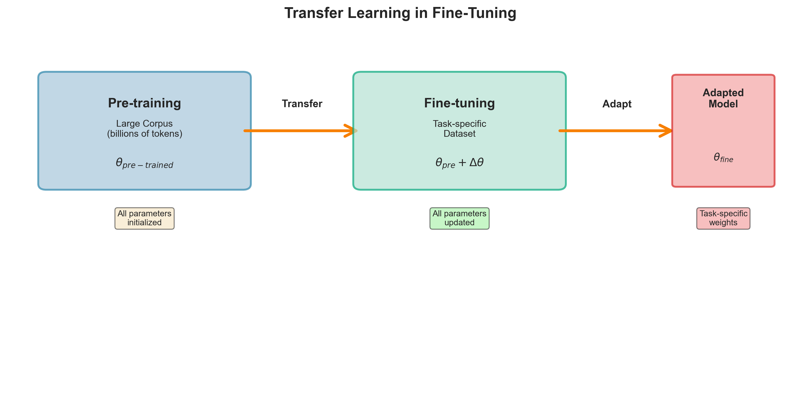
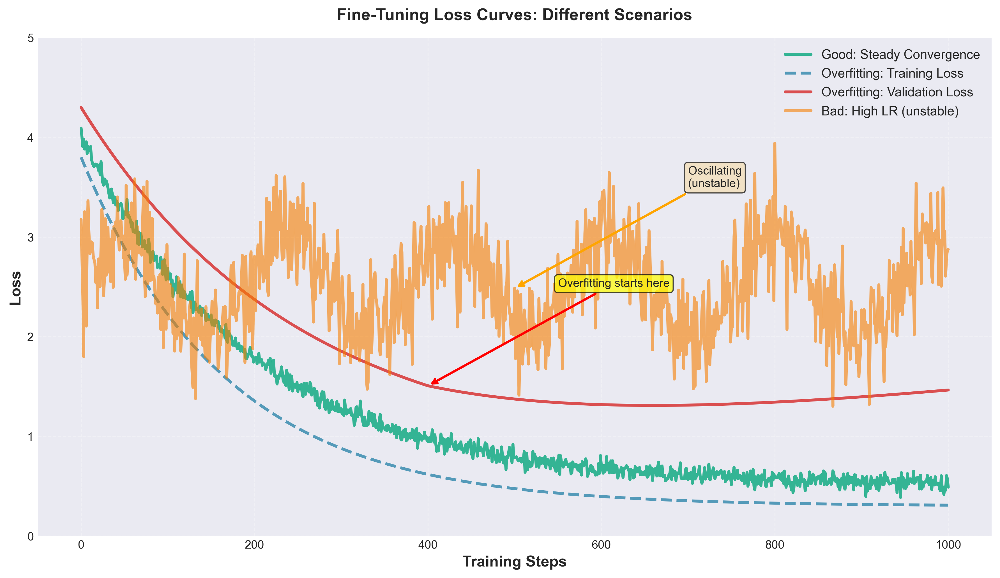
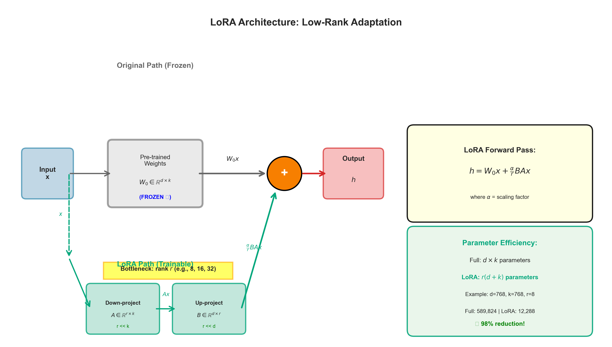
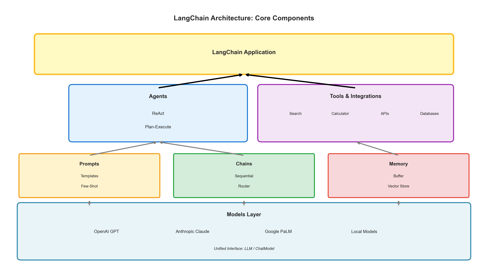
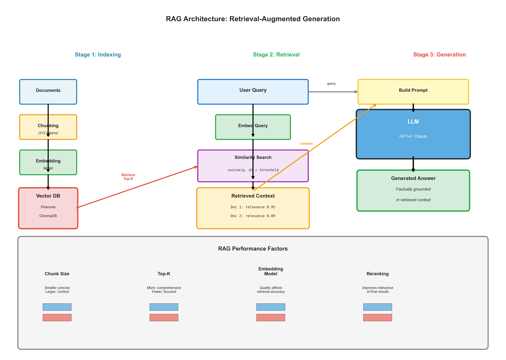
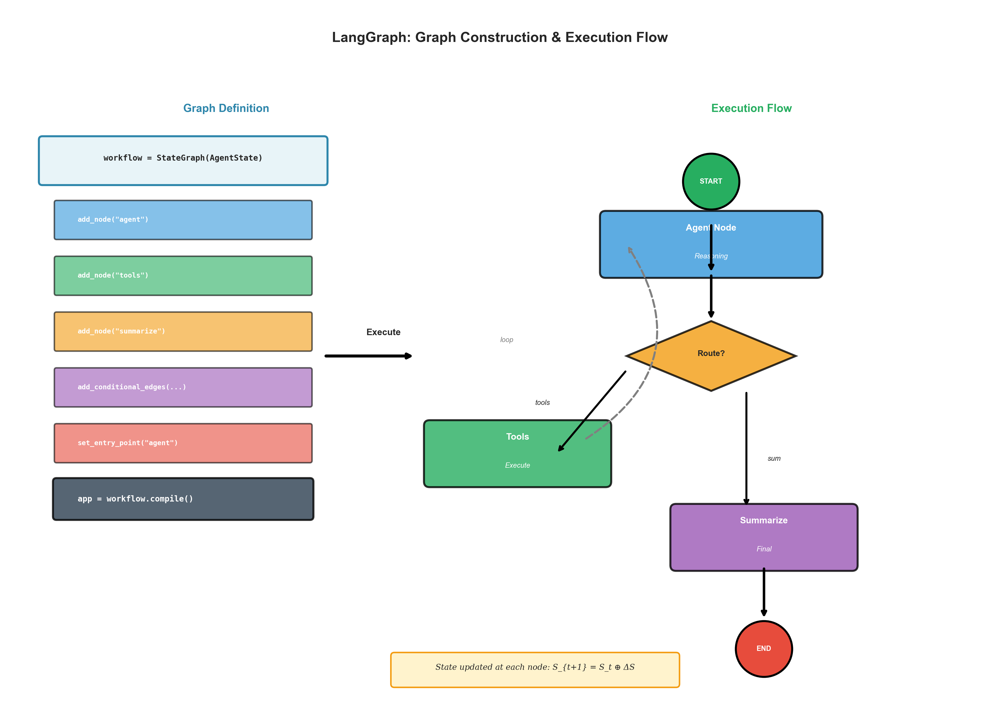

# Generative AI Study Materials

[](LICENSE)
[](docs/LLM_Study_Material.pdf)
[](requirements.txt)
[](notebooks/)
[]()
[]()

> **Comprehensive university-level study guide for Large Language Models (LLMs), transformers, RLHF, fine-tuning, and generative AI techniques. Includes 440+ pages of theory with rigorous mathematical derivations (actively expanding), 69+ visualizations, and 4 practical Jupyter notebooks. Regular updates with enhanced content and new implementations.**

**Keywords:** Large Language Models, LLM, Transformers, RLHF, LoRA, QLoRA, Fine-Tuning, GPT, BERT, Attention Mechanism, Pre-training, Instruction Tuning, RAG, LangChain, LangGraph, Deep Learning, Natural Language Processing, NLP, Machine Learning, AI Safety

This repository contains comprehensive study materials for understanding Large Language Models (LLMs) and generative AI techniques. The materials are designed for university-level learners and cover both theoretical foundations and practical implementations.

## Repository Structure

```
GenAi_Prep/
├── docs/                          # Documentation and compiled PDFs
│   ├── LLM_Study_Material.pdf    # Main study guide (440 pages)
│   └── GenAI-Part-2.pdf          # Supplementary materials
├── notebooks/                     # Jupyter notebooks for hands-on learning
│   ├── Finetuning_Dr_Patient.ipynb
│   ├── GPT_2_FINETUNING_QLoRA.ipynb
│   ├── LORA_FINE_TUNING.ipynb
│   └── Shoolini_Pretraining.ipynb
├── latex/                         # LaTeX source files
│   ├── LLM_Study_Material.tex
│   └── AI_Assignment_3.tex
├── visualization/                 # Educational visualizations
│   ├── images/                   # Generated diagrams (69+ visualizations)
│   ├── scripts/                  # Python visualization generators
│   └── README.md
├── requirements.txt              # Python dependencies
└── README.md
```

## Primary Study Material

**`docs/LLM_Study_Material.pdf`** (440 pages, actively expanding)

The main study document covering end-to-end LLM development, from fundamental concepts through advanced techniques. Each section includes mathematical derivations, practical code implementations, hyperparameter guidance, and debugging strategies.

> **Latest Update (November 12, 2025):** Added comprehensive advanced mathematical theory including:
> - **Scaling Laws** (Kaplan 2020, Chinchilla 2022): Complete derivations with Lagrange optimization, compute-optimal training formulas
> - **Eckart-Young Theorem**: SVD-based optimality proof for low-rank approximation in LoRA
> - **Quantization Noise Analysis**: E[ε²] = Δ²/12 derivation, SQNR formula (6 dB per bit rule)
> - **Optimization Dynamics**: AdamW convergence under FP16, Fisher Information, Adafactor memory efficiency
> - **Information-Theoretic Perspective**: Mutual information flow, layer redundancy analysis, compression bounds
> - **10 Professional TikZ Diagrams**: Iso-compute curves, SVD visualization, quantization noise, convergence trajectories, information flow
> - **Total Enhancement**: +1,102 lines, +33 pages of rigorous mathematical content with complete step-by-step derivations

### Topics Covered

**Foundation & Architecture**
- Transformer architecture and self-attention mechanisms
- Tokenization strategies and embedding techniques
- Positional encodings and attention patterns

**Training Methodologies**
- Pre-training objectives and optimization techniques
- Fine-tuning approaches (LoRA, QLoRA, PEFT)
- Reinforcement Learning from Human Feedback (RLHF)
- Direct Preference Optimization (DPO)

**Advanced Mathematical Theory**
- **Scaling Laws**: Kaplan & Chinchilla compute-optimal training (N_opt ∝ C^0.5, D_opt ∝ C^0.5)
- **Eckart-Young Theorem**: Optimal low-rank approximation with SVD, error bounds for LoRA
- **Quantization Noise**: Complete derivation of E[ε²] = Δ²/12, SQNR analysis for 4-bit quantization
- **Optimization Dynamics**: AdamW convergence under low-precision, Fisher Information Matrix
- **Information Theory**: Mutual information I(X;H), layer redundancy (92% in GPT-2 layers 9-12)

**Advanced Techniques**
- Instruction fine-tuning and dataset preparation
- Model evaluation and benchmarking methodologies
- Retrieval-Augmented Generation (RAG) systems
- LangChain and LangGraph frameworks

**Production Considerations**
- Safety, ethics, and bias mitigation
- Hyperparameter tuning and optimization
- Memory efficiency and quantization
- Debugging strategies and common pitfalls

## Jupyter Notebooks

### `notebooks/Finetuning_Dr_Patient.ipynb`
Practical implementation of fine-tuning techniques using medical conversation datasets. Demonstrates data preparation, model configuration, and training loops.

### `notebooks/GPT_2_FINETUNING_QLoRA.ipynb`
Hands-on guide to parameter-efficient fine-tuning using QLoRA (Quantized Low-Rank Adaptation). Includes memory optimization strategies and performance benchmarking.

### `notebooks/LORA_FINE_TUNING.ipynb`
Implementation of Low-Rank Adaptation for efficient model fine-tuning. Covers adapter configuration, training procedures, and model merging techniques.

### `notebooks/Shoolini_Pretraining.ipynb`
Pre-training demonstration covering tokenization, data processing pipelines, and training optimization for language models from scratch.

## Visualizations

The repository includes 47 educational visualizations covering key LLM concepts:

### Fine-Tuning Workflows

<p align="center">
  
</p>

*Figure: Transfer learning process showing the transition from pre-trained models to task-specific fine-tuning.*

<p align="center">
  
</p>

*Figure: Training and validation loss curves demonstrating convergence behavior during fine-tuning.*

### LoRA Architecture

<p align="center">
  
</p>

*Figure: Low-Rank Adaptation architecture showing parameter-efficient fine-tuning through low-rank matrices.*

<p align="center">
  
</p>

*Figure: Performance comparison across different rank values in LoRA, illustrating the trade-off between efficiency and model capacity.*

### LangChain Framework

<p align="center">
  
</p>

*Figure: LangChain architecture demonstrating the modular components for building LLM applications.*

<p align="center">
  
</p>

*Figure: Retrieval-Augmented Generation (RAG) architecture showing the integration of external knowledge retrieval with language generation.*

### LangGraph Execution

<p align="center">
  
</p>

*Figure: LangGraph execution flow demonstrating stateful, graph-based agent orchestration.*

See `visualization/README.md` for the complete collection of visualizations and usage instructions for generating custom diagrams.

## Repository Statistics

- **Study Material**: 440 pages of comprehensive content (actively expanding)
- **Jupyter Notebooks**: 4 practical implementations
- **Visualizations**: 69+ educational diagrams across 9 categories
  - 47 Python-generated visualizations (matplotlib/seaborn)
  - 10 LaTeX TikZ mathematical diagrams
  - 12 updated RAG architecture visualizations
- **Code Examples**: Production-ready implementations with extensive documentation
- **Topics Covered**: 12 major sections from fundamentals to advanced techniques
- **Mathematical Content**: 60+ equations with complete derivations
- **Status**: Actively maintained with regular updates

## Development Status & Roadmap

### Recently Completed (v1.0.0)

**Section 8 Enhancement - RLHF (Reinforcement Learning from Human Feedback):**
- Complete RLHF pipeline implementation (SFT → Reward Model → PPO)
- Production-ready TRL (Transformer Reinforcement Learning) code (~725 lines)
- Comprehensive DPO (Direct Preference Optimization) implementation
- 4 hyperparameter guidance boxes with justified recommendations
- 4 common pitfalls & debugging sections with solutions
- 5 key takeaways boxes summarizing core concepts
- All code extensively documented with step-by-step explanations
- Fixed LaTeX rendering issues in all tcolorbox environments

### Currently In Progress

**Section 9 - Instruction Fine-Tuning & SFT Datasets:**
- Instruction dataset formats (Alpaca, ShareGPT, etc.)
- Dataset quality assessment and curation strategies
- Multi-task instruction tuning methodologies
- LoRA/PEFT integration for efficient instruction tuning
- Production code examples with dataset loading and training loops
- Hyperparameter guidance for instruction fine-tuning
- Common pitfalls in dataset preparation and model alignment

**Section 10 - Evaluation & Benchmarking:**
- Comprehensive metric coverage (Perplexity, BLEU, ROUGE, BERTScore)
- Human evaluation methodologies and inter-rater reliability
- Benchmark suite analysis (MMLU, HellaSwag, TruthfulQA, etc.)
- Statistical significance testing for model comparisons
- Production code for automated evaluation pipelines
- Best practices for avoiding benchmark overfitting

**Section 11 - Safety, Ethics & Bias Mitigation:**
- Bias detection and measurement techniques
- Safety filtering and content moderation strategies
- Constitutional AI and value alignment approaches
- Demographic bias analysis with statistical tests
- Red-teaming and adversarial testing methodologies
- Regulatory compliance and ethical guidelines

### Planned Updates

**Near-Term (Next Updates):**
- Complete Sections 9-11 with same depth as enhanced Section 8
- Add TikZ diagrams for visual concept representation
- Expand visualization collection with new categories
- Add exam-style summary boxes for quick revision
- Include more real-world case studies and examples

**Medium-Term:**
- Section 12+ expansions based on emerging techniques
- Additional Jupyter notebooks for advanced topics
- Interactive visualization tools and notebooks
- Video walkthrough scripts for complex concepts
- Expanded code examples for production deployment

**Long-Term:**
- Continuous updates reflecting latest research (2024-2025)
- Advanced topics: Mixture of Experts, Sparse Models, Multimodal LLMs
- Extended RAG implementations with vector databases
- Agent frameworks and autonomous systems
- Performance optimization and deployment strategies

### Content Enhancement Philosophy

Each section follows a consistent quality standard:

1. **Teacher-Quality Exposition**: First principles → Intuition → Formalization → Implementation
2. **Mathematical Rigor**: Step-by-step derivations with clear notation
3. **Production Code**: Extensively commented, runnable examples with real hyperparameters
4. **Practical Guidance**: Hyperparameter recommendations, common pitfalls, debugging strategies
5. **Structured Summaries**: Key takeaways boxes for quick reference

### Update Frequency

- **Major Updates**: Monthly (new sections, significant enhancements)
- **Minor Updates**: Bi-weekly (fixes, clarifications, additional examples)
- **Continuous**: Bug fixes, typo corrections, user-reported issues

## Getting Started

### Prerequisites

- Python 3.8 or higher
- LaTeX distribution (for compiling `.tex` files from the `latex/` directory)
- Jupyter Notebook or JupyterLab
- CUDA-compatible GPU (recommended for training notebooks)

### Installation

1. Clone this repository:
   ```bash
   git clone <repository-url>
   cd GenAi_Prep
   ```

2. Create a virtual environment:
   ```bash
   python -m venv venv
   source venv/bin/activate  # On Windows: venv\Scripts\activate
   ```

3. Install required packages:
   ```bash
   pip install -r requirements.txt
   ```

### Usage

**For theoretical study:**
Refer to `docs/LLM_Study_Material.pdf` for comprehensive coverage of concepts, mathematics, and implementation details.

**For practical implementation:**
Open the relevant notebook in the `notebooks/` directory and follow the step-by-step code examples. Each notebook includes detailed comments explaining the rationale behind implementation choices.

**For visualization generation:**
Navigate to the `visualization/` directory and refer to the README for script usage and customization options.

## Learning Path

For those new to LLMs, the recommended learning sequence is:

1. **Foundation** (Sections 1-3): Transformer architecture, tokenization, embeddings
2. **Pre-training** (Section 4): Language modeling objectives, optimization techniques
3. **Fine-tuning** (Sections 5-7): Transfer learning, LoRA, QLoRA, PEFT methods
4. **RLHF and Alignment** (Section 8): Reward modeling, PPO, DPO
5. **Advanced Topics** (Sections 9-12): Instruction tuning, evaluation, safety, RAG systems

Supplement theoretical study with the corresponding notebooks in `notebooks/` to reinforce understanding through implementation. Use the visualizations in `visualization/images/` as reference diagrams while studying.

## Technical Notes

### Code Quality

All code examples follow production-ready standards:
- Comprehensive inline documentation
- Explicit hyperparameter specifications with justifications
- Error handling and validation checks
- Memory optimization strategies for resource-constrained environments

### Mathematical Rigor

Mathematical derivations are presented with:
- Step-by-step progression from intuition to formalization
- Clear notation and variable definitions
- Dimensionality analysis for tensor operations
- Computational complexity considerations

## Compilation

To regenerate the PDF from LaTeX source files:

```bash
cd latex/
pdflatex -interaction=nonstopmode LLM_Study_Material.tex
pdflatex -interaction=nonstopmode LLM_Study_Material.tex  # Run twice for TOC
```

The compiled PDF will be generated in the `latex/` directory and can be moved to `docs/` for distribution.

## Contributing

This is an actively maintained study materials repository. Contributions are welcome in the following forms:

### Reporting Issues
If you identify errors or areas for improvement, please document them clearly with:
- Section/page reference
- Description of the issue
- Suggested correction with supporting references

### Suggesting Enhancements
- Additional topics or subtopics to cover
- Improved explanations or alternative approaches
- Additional code examples or visualizations
- Real-world use cases and applications

### Stay Updated
- **Watch** this repository for updates
- **Star** to bookmark and support the project
- Check the [Releases](https://github.com/ayanalamMOON/GenAi_Prep/releases) page for version history
- Follow the [Projects](https://github.com/ayanalamMOON/GenAi_Prep/projects) board for development progress

## Changelog

### Version 1.1.0 (November 12, 2025)
**Major Enhancement: Advanced Mathematical Theory**
- **Added 1,102 lines (+33 pages) of rigorous mathematical content**
- **Scaling Laws**: Complete Kaplan (2020) and Chinchilla (2022) derivations
  - Full Lagrange optimization with 15+ equations
  - Compute-optimal formulas: N_opt ∝ C^0.50, D_opt ∝ C^0.50
  - Gopher vs Chinchilla comparison table
  - 8×6 TikZ diagram with iso-compute curves and optimal paths
- **Eckart-Young Theorem**: SVD-based optimality proof for LoRA
  - Frobenius norm error bounds: ||ΔW - ΔW_r||²_F = Σσ²_i
  - Connection to low-rank adaptation
  - Empirical validation table with singular value decay
  - TikZ diagram showing SVD decomposition and rank truncation
- **Quantization Noise Analysis**: Complete mathematical foundation for QLoRA
  - Step-by-step derivation: E[ε²] = Δ²/12
  - SQNR formula: 6.02b + 1.76 dB (6 dB per bit rule)
  - NF4 vs Int4 comparison (58% noise reduction)
  - Bit-width comparison table (2-bit to 32-bit)
  - 3-panel TikZ diagram: signal quantization, error distribution, SQNR plot
- **Optimization Dynamics**: AdamW convergence under low-precision arithmetic
  - Complete 6-step convergence proof with quantization noise
  - Fisher Information Matrix: F_ij = E[∂_i log p · ∂_j log p]
  - Adafactor factorization for memory efficiency (nm → n+m)
  - 4-panel TikZ diagram: FP32/BF16/FP16 convergence, adaptive LR, memory comparison
- **Information-Theoretic Perspective**: Layer redundancy and compression analysis
  - Mutual information: I(X;H) = H(X) - H(X|H)
  - Information Bottleneck Principle
  - Empirical GPT-2 layer analysis (40% → 100% information retention)
  - Redundancy matrix showing 92% redundancy in final layers
  - Connection to LoRA low-rank adaptation
  - 3-panel TikZ diagram: information flow, redundancy heatmap, compression trade-off
- **10 Professional TikZ Diagrams**: High-quality mathematical visualizations
- **Bug Fixes**: Resolved all (??) equation reference errors and duplicate fig:training_dynamics label
- **Document Growth**: 407 pages → 440 pages (27.98 MB)

### Version 1.0.0 (November 2025)
- Initial release with 335 pages of comprehensive content
- Enhanced Section 8 (RLHF) with production implementations
- 47 educational visualizations across 6 categories
- 4 practical Jupyter notebooks
- Complete LaTeX source files
- Professional repository structure and documentation

### Future Versions
See [Development Status & Roadmap](#development-status--roadmap) for planned updates.

## License

These materials are provided for educational purposes. Please respect copyright and attribution requirements when using external code libraries or datasets referenced in the notebooks.

## Acknowledgments

This study guide synthesizes knowledge from research papers, technical documentation, and open-source implementations. Specific citations are included throughout the PDF document where applicable.

---

## Citation

If you use these materials in your research or teaching, please cite:

```bibtex
@misc{genai_study_materials_2025,
  title={Comprehensive Study Materials for Large Language Models and Generative AI},
  author={Ayana},
  year={2025},
  publisher={GitHub},
  howpublished={\\url{https://github.com/YOUR_USERNAME/GenAi_Prep}}
}
```

## Related Topics

`large-language-models` `transformers` `deep-learning` `machine-learning` `nlp` `natural-language-processing` `artificial-intelligence` `rlhf` `fine-tuning` `lora` `qlora` `gpt` `bert` `attention-mechanism` `retrieval-augmented-generation` `langchain` `langgraph` `pre-training` `instruction-tuning` `reinforcement-learning` `python` `jupyter-notebook` `education` `study-guide` `university` `research`
